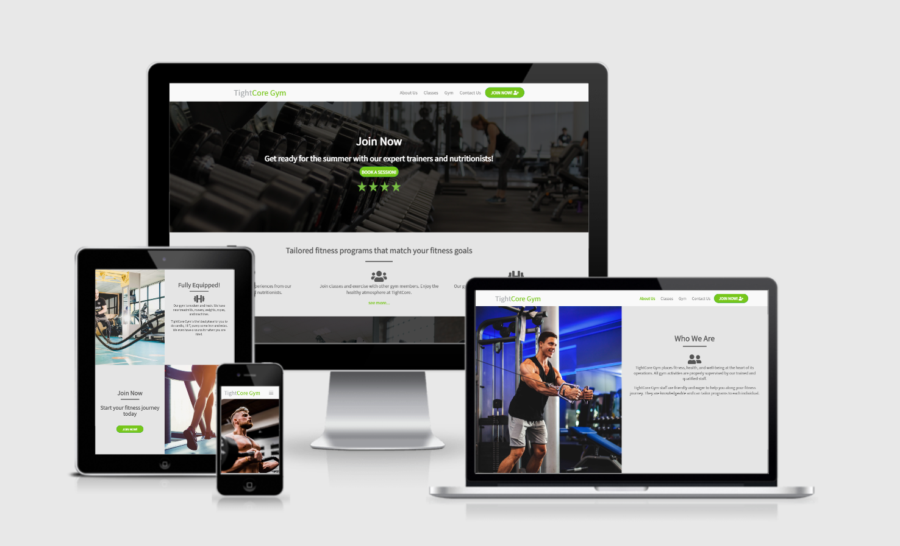
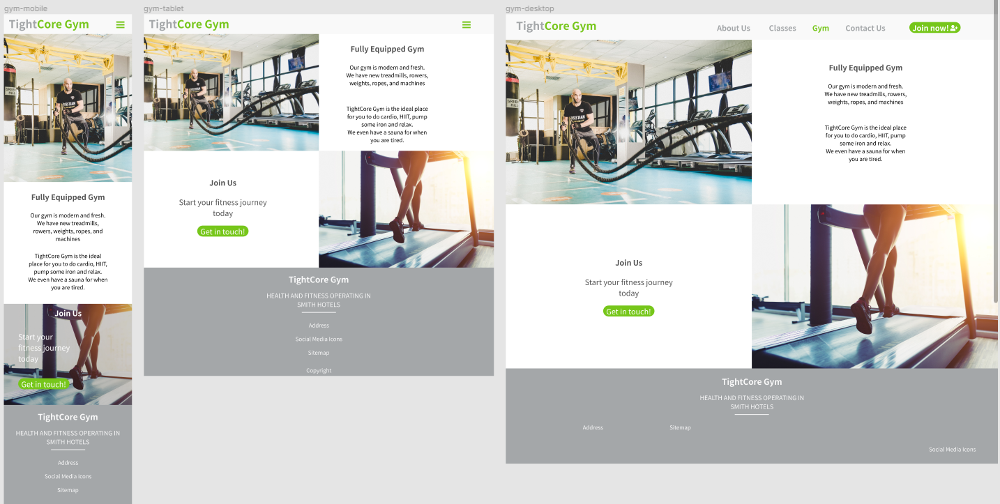
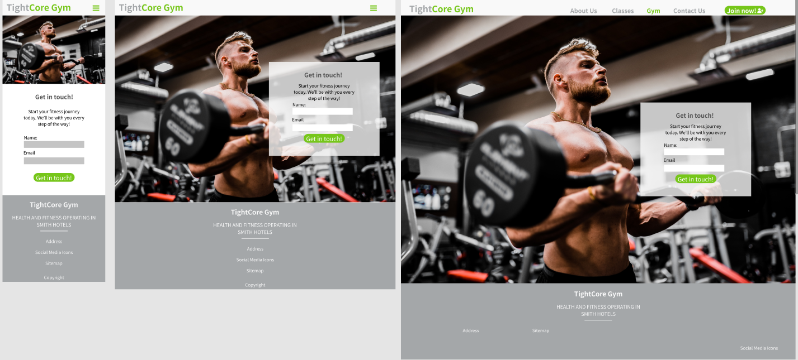
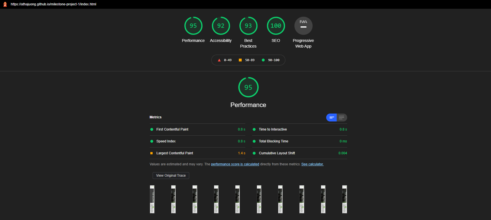

# TightCore Gym
## Code Institute: Milestone Project 1

TightCore Gym is a fictional gym that offers guidance to clients wanting to improve their health, fitness, or body composition. This project idea was offered by Code Institute as part of their softare development program. As a person with keen interests in sports, health, and lifestyle, I thought it would be interesting to create a project reflecting a business that helps people stay active and healthy. 

This was the first of the milestone projects that make up Code Institute's Full-Stack Software Development Course as of Feb. 2021.
This static website is required to be responsive and comprises of pages developed with HTML5 and CSS3.

View the live project here: [TightCore Gym](https://athajuong.github.io/milestone-project-1/index.html)

## UX

### Site Owner's Goal:
This website aims to attract customers that will avail of the gym's equipment, classes, instructors, and nutritionists. The owner aims to encourage customers of all shapes and sizes to reach their own health and fitness targets.

### Ideal demographics:
The target demographics of this website will include:

* Gym experts and body builders
* Competitive fitness enthusiasts
* Casual fitness enthusiasts
* Regular gym customers
* Social customers

### User Stories/Buyer Personas

New/Potential Customer's Goal:
1. I want to navigate the website easily and find relevant information without an excessive time investment.
2. I want to learn about the facilities and available exercise classes.
3. I want to learn what resources are available to help me on my fitness journey.
4. I want to easily find information about the gym - its location and its training teams.
5. I want to find social proof as to the quality of the gym.

Current Customer's Goals:
1. As a current customer, I want to easily navigate the website to find relevant information.
2. As a current customer, I want to discover new offers and changes at my gym.
3. As a current customer, I want information on exercise classes.

## Website Development Considerations
To develop this website and address the interests of the sample buyer personas mentioned above, the developer spoke with various individuals. This was so the developer could gauge the functions and features that real-life customers would look for in a gym website. That information would inform the developer on how best to target the new/potential customers and current customers for "TightCore Gym".

### Strategy of website
This website is made for three key overarching segments.

1. Customer Type:
   1. Current gym customers
   2. New/Potential gym customers

2. Demographic:
   1. Age range: Under-55
   2. Male customers
   3. Female customers

3. Psychographic:
   1. Interests:
      * Health & lifestyle
      * Exercise
      * Sports
      * Bodybuilding or body composition
      * Weight loss

   2. Lifestyle:
      * Active 
      * Outgoing
      * Social
      * Sedentary

   3. Values:
      * Health
      * Healthy food
      * Exercise
      * Routine
      * Fitness
      * Beauty

This website needs to enable TightCore Gym to:

* Develop an online presence
* Offer a digital space for customers to acquire information about:
   * the gym
   * gym/exercise classes
   * services on offer
* Provide a communication channel for customers to contact the gym

This website needs to enable customers to:
* Find information about the gym
* Find information about the gym's services
* Contact the gym
* Find the gym on their platform of choice - phone, tablet, social media channels, etc.

Considering the outline of this strategy and the goals mentioned above, the developer created a strategy table to determine the importance and viability of the outlined website goals.

### Scope of website

A website scope was determined in order to deliver on the goals targeted in the website's strategy. The idea was to align the website's features with the intended purposes of the website. The features of the website fall into two categories, namely content and functionality.

#### Content requirements:
A user visiting the TightCore Gym website will look for:
* Information on gym facilities - equipment, pool, steam room, etc.
* Services offered - exercise classes, instructors, nutrition advice
* Contact and location details
* Transparency: information about the gym and its staff
* Social links
* Deals and promotions

#### Functionality requirements:
A user visiting the TightCore Gym website will be able to:
* Navigate the website effortlessly
* Browse the website on different platforms
* Find information about the services offered
* Contact the gym directly from the website
* Be able to find external social proofs by visiting social media links

### Structure of website
The information hierarchy of this website was outlined with considerations taken from the strategy and scope of the site. A sample sitemap was created in Adobe Photoshop and will be used to inform the content and functionality requirements of the website.

### Skeleton of website
The developer created wireframe mockups in a . The intention was to design a sample website that kept user experience in mind while reflecting the strategy, scope, and structure of the website.

Home page:

About us page:

Classes page:

Gym page:

Contact page:

## Features

This project has five different pages. A user can navigate between each page by clicking on the links in the regular or toggle navigation bar.

### Consistent design:
* The developer has kept the logo on the top, left-hand side of all pages so that there is consistent branding. 
* Navigation bar varius between toggle and full width but styles are uniform across both.
* Consistent footer design across all pages and all page sizes.

#### Home Page:
* From the home page, it is clear to see that this website is a gym.
* Hero image has an overlay to ensure the text and call-to-action are both visible for any user.
* Designed "Trustpilot"-themed stars to give some social proof. Four stars placed under the button, to convince users that the gym is legitimate and trustworthy.
* The home page also offers reasons as to why the user should either become a member or sample TightCore's services.
* Users can get in touch with the gym directly from the landing page using the button in the hero image.
* Users can navigate to appropriate content about classes, gym trainers and the gym facilities using links in the content section.
* Two panels provide sample images of people training and tell the customers about the facilities and classes on offer. They can follow links to learn more.
* Customers can show their intent to sign up for membership by following a button that leads them to contact the gym. They learn the benefits of membership here.

#### About Us Page:
* The about us page offers an insight into the motivation and values of the company.
* The about us page then provides pictures and bios of the staff members that work at the company.

#### Classes Page:
* This page offers an idea of the types of classes the gym offers.
* A YouTube video was embedded using iframe. Users can get a sense of what it is like to take part in gym activities.

#### Gym Page
* The gym page offers an idea of the type of equipment held in TightCore. 
* Another call-to-action nudging customers to sign up.

#### Contact Page
* The contact page is a simple one with a form. 
* A hero image is placed as the header with a contact form overlaying on desktop.
* On other devices, the form is placed below the hero image.

## Features to Add
* The website would be more functional with a direct communications line to the customers. It is not currently viable, but chatbots would improve customer wait times.
* After learning further technologies, the developer could add a blog section where customers could learn about food, exercise, and healthy living.
* With new technologies, the developer could add a gated portal for current members. Members would get premium content and even more attention.

These features currently go beyond the scope of the first project but can be toyed with in the near future.

## Technologies Used
* HTML5 - The language used to create the skeleton of the website. Forms, buttons, sections, divisions, etc.
* CSS3 - The language used to style the HTML5 pages and elements. 
* [Bootsrap](https://getbootstrap.com/) - The developer used the bootstrap framework to structure the website's layouts more easily. This was beneficial when developing for mobile and mobile devices first.

* [Figma](https://www.figma.com/file/tWD50wf2MlbyRV5sjfmvcS/Untitled?node-id=78%3A42) - Here is a link to my Figma workspace. This was used to draft and realise the ideas behind the design of the website. 

* [Unsplash](https://www.unsplash.com/) - I relied on Unsplash.com for images as they are royalty free and also high-quality. A perfect location to source images for a website.

* [TinyPNG](https://tinypng.com/) - The developer used this website to compress all of his images. This was intended to lower page load times and improve user experience.

* [Google Fonts](https://fonts.google.com/) - Is where the developer selected the "Noto Sans KR" font after perusing Googles font library for something suitable.

* [Stack Overflow](https://www.stackoverflow.com) - The developer often browsed the website when code would go awry. There is a lot of guidance on Stack and it improves the understanding of different tag functions.

* [W3C Schools](https://w3schools.com) - This website is very informative. The developer would often consult W3Schools and constantly revisit various tags of code.

## Testing
The developer tested the website across different browsers and according to the functions they were intended to achieve.

### Validating the HTML and CSS:

#### HTML Validation
The developer used [W3C's HTML Validator](https://validator.w3.org/) to check his pages for any validation errors. The [TightCore Gym](https://athajuong.github.io/milestone-project-1/index.html) website passed the HTML validation with no errors.

#### CSS Validation
The developer used [W3's Jigsaw CSS validator](https://jigsaw.w3.org/css-validator/validator) to check his css for any validation errors and the website passed with no errors.

#### Lighthouse Validation

##### Content Requirements
The developer believes this website can fulfill its intended content requirements.

The website does help customers find information on:
* Information on gym facilities - equipment.
* Services offered - exercise classes, instructors.
* Contact and location details
* Transparency: information about the gym and its staff
* Social links

##### Functionality Requirements

The developer believes this website can fulfill its intended functionality requirements.

The website enables customers to:
* Navigate the website effortlessly
* Browse the website on different platforms
* Find information about the services offered
* Contact the gym directly from the website
* Be able to find external social proofs by visiting social media links

### Testing Browsers
The developer manually tested the website across 3 separate browsers. Namely:

* Google Chrome
* Mozilla Firefox
* Microsoft Edge

### Testing Responsive Design
The developer manually tested the website's responsive design using Google's Developer Tools. The website is responsive across multiple devices. 

It should be noted that the developer did not choose to make the website responsive for devices below a maximum width of 370px.

* Google developer tools - allows you to check responsiveness across multiple devices.
* Collected feedback from different friends and family members.

### Issues Discovered
Initially the developer wanted to use a fixed navigation bar, he found that it left spaces behind and above it. Rather than using a fixed navigation bar, the developer opted for a navigation bar that remained in its position.

The developer wanted to use the contact form to gather data on customers but without a server or knowledge on servers, he could not. Instead, the contact form remains as an example of what it could achieve rather than a true solution.

The devloper had challenges organising the layout for the gym page. Having panels with content side-by-side and removing them at certain screen sizes. The developer reused his own code from the home page's panels and filled in the blanks.

## Deployment
This project was created in GitPod's development environment. 

To make this project viewable to the public, the developer followed these steps:

1. Enter [Github Repository](https://github.com/AthAjuong/milestone-project-1)
2. Go to settings tab
3. Go to pages section
4. Choose a master branch for the project, "main"

This deployed the TightCore Gym website that is now viewable [here](https://athajuong.github.io/milestone-project-1/index.html).

### Cloning the Project

If you would like to work on this project further you can clone it to your local machine using the following steps:

1. Scroll to the top of my repository and click on the "clone or download button"
2. Decide whether you want to clone the project using HTTPS or an SSH key and do the following:
3. HTTPS: click on the checklist icon to the right of the URL
4. SSH key: first click on 'Use SSH' then click on the same icon as above
5. Open the 'Terminal'
6. Change the current working directory to the location where you want the cloned directory
7. Type 'git clone', and then paste the URL you copied earlier.
8. Press 'Enter' to create your local clone.

Feel free to read about [Cloning a Repository](https://docs.github.com/en/github/creating-cloning-and-archiving-repositories/cloning-a-repository-from-github/cloning-a-repository) if there is any confustion.

## Credits

This website is a fictional website written for the purposes of completing Code Institute's first milestone project. The content is written by the developer alone.

### Media
Any media used in the project will be referenced here.

#### Images:
* [Hero image](https://unsplash.com/photos/CQfNt66ttZM)
* [Home stretches](https://unsplash.com/photos/gJtDg6WfMlQ)
* [Home gym machines](https://unsplash.com/photos/0sa8D74iodI)

* [About hero](https://unsplash.com/photos/wXBK9JrM0iU)
* [Austin portrait](https://unsplash.com/photos/X6Uj51n5CE8)
* [Joseph portrait](https://unsplash.com/photos/iFgRcqHznqg)
* [Nessa portrait](https://unsplash.com/photos/mEZ3PoFGs_k)

* [Classes hero](https://unsplash.com/photos/y0SMHt74yqc)

* [Gym hero](https://unsplash.com/photos/yiQCexXTXJI)
* [Treadmill runner](https://www.freepik.com/free-photo/fitness-girl-running-treadmill_6522032.htm#page=1&query=treadmill&position=1)

* [Contact hero image](https://unsplash.com/photos/7kEpUPB8vNk)

#### Video:

* [Gym Video-Airah](https://www.youtube.com/embed/vi1-4fcX_ig)

## Acknowledgements

I would like to take a moment to thank my mentor Seun Owonikoko for her insights as a developer.
I would also like to thank Code Institute's Student Care team for the advice given over the months.
I would like to thank my fellow students on Slack for the overflowing enthusiasm and quick solutions to coding's challenges.
Lastly, I would like to thank my family for the support they offer me on this new path.
