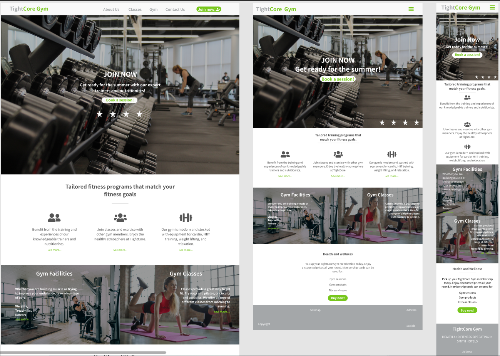

# TightCore Gym
## Code Institute: Milestone Project 1

TightCore Gym is a fictional gym that offers guidance to clients wanting to improve their health, fitness, or body composition. This project idea was offered by Code Institute as part of their softare development program. As a person with keen interests in sports, health, and lifestyle, I thought it would be interesting to create a project reflecting a business that helps people stay active and healthy. 

This was the first of the milestone projects that make up Code Institute's Full-Stack Software Development Course as of Feb. 2021.
This static website is required to be responsive and comprises of pages developed with HTML5 and CSS3.

## UX

### Site Owner's Goal:
This website aims to attract customers that will avail of the gym's equipment, classes, instructors, and nutritionists. The owner aims to encourage customers of all shapes and sizes to reach their own health and fitness targets.

### Ideal demographics:
The target demographics of this website will include:

* Gym experts and body builders
* Competitive fitness enthusiasts
* Casual fitness enthusiasts
* Regular gym customers
* Social customers

### User Stories/Buyer Personas

New/Potential Customer's Goal:
1. I want to navigate the website easily and find relevant information without an excessive time investment.
2. I want to learn about the facilities and available exercise classes.
3. I want to learn what resources are available to help me on my fitness journey.
4. I want to easily find information about the gym - its location and its training teams.
5. I want to find social proof as to the quality of the gym.

Current Customer's Goals:
1. As a current customer, I want to easily navigate the website to find relevant information.
2. As a current customer, I want to discover new offers and changes at my gym.
3. As a current customer, I want information on exercise classes.

## Website Development Considerations
To develop this website and address the interests of the sample buyer personas mentioned above, the developer spoke with various individuals. This was so the developer could gauge the functions and features that real-life customers would look for in a gym website. That information would inform the developer on how best to target the new/potential customers and current customers for "TightCore Gym".

### Strategy of website
This website is made for three key overarching segments.

1. Customer Type:
   1. Current gym customers
   2. New/Potential gym customers

2. Demographic:
   1. Age range: Under-55
   2. Male customers
   3. Female customers

3. Psychographic:
   1. Interests:
      * Health & lifestyle
      * Exercise
      * Sports
      * Bodybuilding or body composition
      * Weight loss

   2. Lifestyle:
      * Active 
      * Outgoing
      * Social
      * Sedentary

   3. Values:
      * Health
      * Healthy food
      * Exercise
      * Routine
      * Fitness
      * Beauty

This website needs to enable TightCore Gym to:

* Develop an online presence
* Offer a digital space for customers to acquire information about:
   * the gym
   * gym/exercise classes
   * services on offer
* Provide a communication channel for customers to contact the gym

This website needs to enable customers to:
* Find information about the gym
* Find information about the gym's services
* Contact the gym
* Find the gym on their platform of choice - phone, tablet, social media channels, etc.

Considering the outline of this strategy and the goals mentioned above, the developer created a strategy table to determine the importance and viability of the outlined website goals.

### Scope of website

A website scope was determined in order to deliver on the goals targeted in the website's strategy. The idea was to align the website's features with the intended purposes of the website. The features of the website fall into two categories, namely content and functionality.

#### Content requirements:
A user visiting the TightCore Gym website will look for:
* Information on gym facilities - equipment, pool, steam room, etc.
* Services offered - exercise classes, instructors, nutrition advice
* Contact and location details
* Transparency: information about the gym and its staff
* Social links
* Deals and promotions

#### Functionality requirements:
A user visiting the TightCore Gym website will be able to:
* Navigate the website effortlessly
* Browse the website on different platforms
* Find information about the services offered
* Contact the gym directly from the website
* Be able to find external social proofs by visiting social media links

### Structure of website
The information hierarchy of this website was outlined with considerations taken from the strategy and scope of the site. A sample sitemap was created in Adobe Photoshop and will be used to inform the content and functionality requirements of the website.

### Skeleton of website
The developer created wireframe mockups in a Figma Workspace. The intention was to design a sample website that kept user experience in mind while reflecting the strategy, scope, and structure of the website.

Home page:

About us page:

Classes page:

